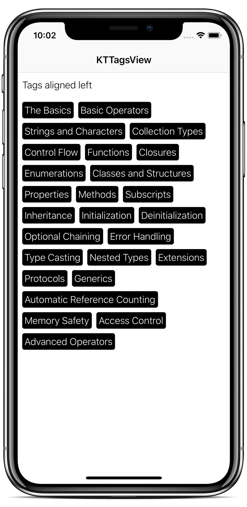
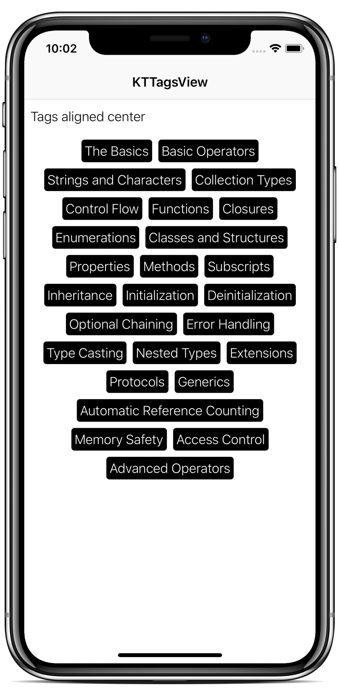
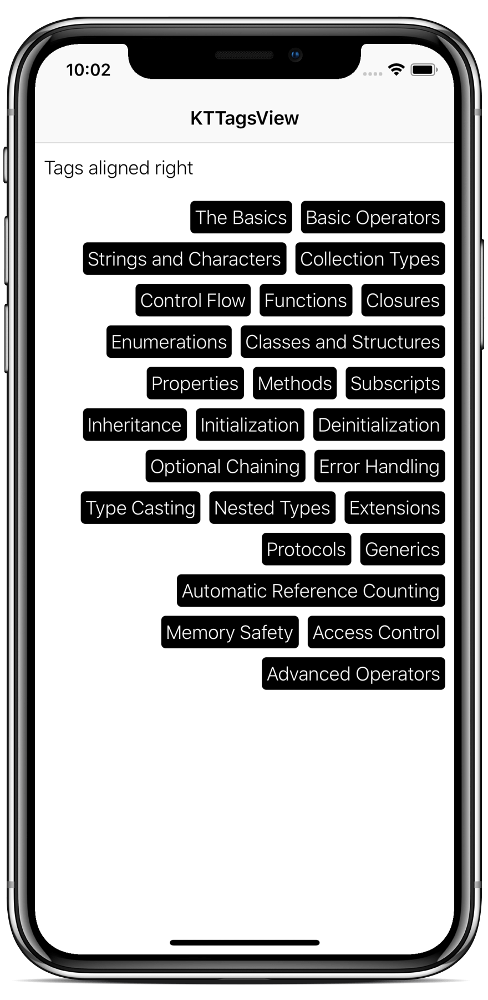

# KTTagsView

<p align="center">
  
</p>


<a href="https://developer.apple.com/swift"></a>
[](http://cocoapods.org/pods/KTTagsView)
[](https://github.com/Carthage/Carthage)
[](https://github.com/iKiKi/KTTagsView/blob/master/LICENSE?raw=true)
[](http://twitter.com/kthoron)

**KTTagsView** offers a Swift `UIView` and *protocols* to help you to display your own custom views as **"tags"**. This library is very useful when you need to display your tags in a `UIScrollView`, as it is handled by a `UIView`.

> 💡 You can display tags using a `UICollectionView` and its `UICollectionLayout`, but its not very suitable to deal with a scrollable element being inside another scrollable element, making it not scrollable etc...

### Features

It also includes a few styling properties:

- **horizontal alignment**: the horizontal alignment of the tags (`left`, `center` or `right`)
- **vertical alignment**: the vertical alignment of the tags (`top`, `center` or `bottom`).
- **intertag spacing**: the minimum spacing between tags.

## 📱Example

<p align="center"></p>

> 💡 To run the [example project](https://github.com/iKiKi/KTTagsView/tree/master/Example), clone the repo, pod install, and run the iOS application.

## Installation

### CocoaPods

The preferred installation method is with [CocoaPods](http://cocoapods.org). Add the following to your `Podfile`:

```ruby
pod 'KTTagsView', '~> 1.0.1'
```

### Carthage

For [Carthage](https://github.com/Carthage/Carthage), add the following to your `Cartfile`:

```ogdl
github "iKiKi/KTTagsView"
```

## Usage

**1)** Implement your own views you need to display as tags (as usual).

<details>
<summary>They just need them to conform to the `TagSizable` protocol.</summary>

```swift
public protocol TagSizable: class {
  associatedtype Tag
  static func preferredSize(with contentSize: CGSize, tag: Tag, at index: Int) -> CGSize
}
```

> 💡 This protocol allows you to manipulate your own type representing a tag, through the `associatedtype`.
</details>

Example with just a `String` as tag:

```swift
import KTTagsView

final class MyTagView: UIView {

  // Implement it as usual
}

// MARK: - TagSizable
extension MyTagView: TagSizable {
  
  static func preferredSize(with contentSize: CGSize, tag: String, at index: Int) -> CGSize {
    //TODO: return the size of your view from the tag
  }
}
```

> ⚠️ Make sure the returned size width do not exceed the contentSize width.

**2)** Implement a `TagsProvider` objet. This aims to hold your tags data and the graphics context to display them using **KTTagsView**.

<details>
<summary>This protocol is very simple.</summary>

```swift
public protocol TagsProvider: TagSizable {
  var tags: [Tag] { get }
  var horizontalAlignment: TagsView.HorizontalAlignment { get }
  var verticalAlignment: TagsView.VerticalAlignment { get }
  var minimumIntertagSpacing: CGFloat { get }
}
```
- **tags**: the property holding tags data.
- **horizontalAlignment**: the horizontal alignment of the tags (left, center or right). This is `.left` by default.
- **verticalAlignment**: the vertical alignment of the tags (top, center or bottom). This is `.top` by default.
- **minimumIntertagSpacing**: the spacing between tags.

> 💡 Note that `TagsProvider` is himself `TagSizable`. In fact, it is expected the object to return the size provided by your views direclty.
</details>

Please find an example below with an object called `TagsViewModel` (always with tags data as `String`):

```swift
import KTTagsView

final class TagsViewModel: TagsProvider {
  
  var tags: [String] {
    //TODO: return your 
  }
  
  var horizontalAlignment: TagsView.HorizontalAlignment = .left
  var verticalAlignment: TagsView.VerticalAlignment = .top
  var minimumIntertagSpacing: CGFloat = 8
  
  // MARK: - TagSizable
  static func preferredSize(with contentSize: CGSize, tag: String, at index: Int) -> CGSize {
    return MyTagView.preferredSize(with: contentSize, tag: tag, at: index)
  }
}
```

**3)** Make an object compliant to the `TagsViewDataSource` protocol. A convenient approach is to use the same `TagsProvider` objet.

<details>
<summary>It can be expected the `TagsProvider` to act as data source..</summary>

```swift
public protocol TagsViewDataSource: class {
  func tagsView(_ tagsView: TagsView, sizeForTagAt index: Int) -> CGSize
  func tagsView(_ tagsView: TagsView, viewForTagAt index: Int) -> UIView
}
```

</details>

Please find an example below with the previous `TagsViewModel` and `MyTagView` object:

```swift
import KTTagsView

// MARK: - TagsViewDataSource
extension TagsViewModel: TagsViewDataSource {
  
  func tagsView(_ tagsView: TagsView, sizeForTagAt index: Int) -> CGSize {
    let tag = self.tags[index]
    return MyTagView.preferredSize(with: tagsView.bounds.size, tag: tag, at: index)
  }
  
  func tagsView(_ tagsView: TagsView, viewForTagAt index: Int) -> UIView {
    let tagView = MyTagView./*init()*/
    let tag = self.tags[index]
    //tagView.update(with: tag)
    return tagView
  }
}
```

**4)** Finally add the `TagsView` to your `UICollectionViewCell`, `UITableViewCell` or any other parent `UIView` and call the `reloadData` passing your `TagsProvider` and `TagsViewDataSource` compliant objects.

```swift
import KTTagsView

final class TagsCollectionViewCell: UICollectionViewCell {
  
  // MARK: Outlets

  @IBOutlet weak var ibTagsView: TagsView!
  
  // MARK: - Internal methods
  
  func update(with viewModel: TagsViewModel) {
    self.ibTagsView.reloadData(with: viewModel, dataSource: viewModel)
  }
}
```

## License

KTTagsView is released under the MIT license. [See LICENSE](https://github.com/iKiKi/KTTagsView/blob/master/LICENSE) for details.
